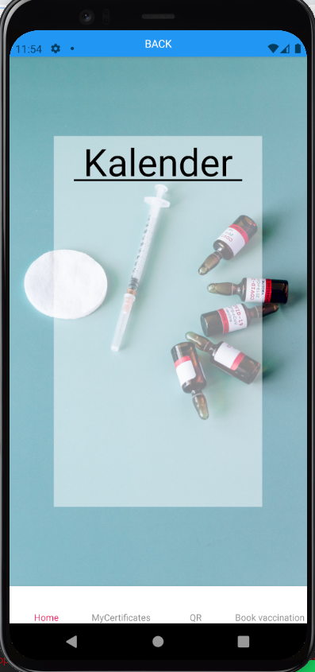

# vaccMe

An application for keeping track of vaccinations. Under development

# Trivia

The app is written in JavaScript using React Native.

# Views for development

## WelcomeScreen

## PersonLoginScreen

## PersonScreen

### PersonHomeScreen

### PersonBookScreen

### PersonCertScreen

### PersonQrScreen

### BusinessLoginScreen

