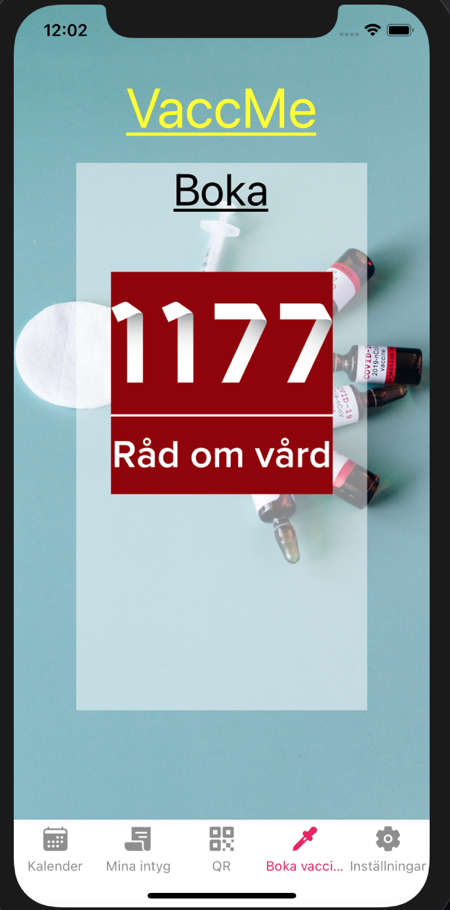

# vaccMe

VaccMe Mobile Application written in React Native by group Gengar

The VaccMe mobile application is a project for the Computer Systems with Project Work course at Uppsala University, spring 2021. It is an application for validating digital vaccination certificates.

# Views for development

## Splash


## WelcomeScreen


## PersonLoginScreen


## PersonScreen


Only exists as a navigator.

### PersonCalendarScreen


### PersonCertScreen


### PersonQrScreen


### PersonBookScreen



### PersonSettingsScreen


## BusinessLoginScreen


### BusinessHomeScreen


### BusinessScanScreen


### BusinessScanScreen scanned


### BusinessValidScreen


### BusinessInvalidScreen


# Dependancies

Using expo for deployment.

### QR-reader

-   Barcode scanner: `expo install expo-barcode-scanner`

```bash
expo install expo-barcode-scanner
```

### Sound effects

-   `expo install`
    -   expo-av

```bash
expo install expo-av
```

### Navigation and tab bar

-   `npm install`
    -   @react-navigation/native
    -   @react-navigation/stack
    -   @react-navigation/bottom-tabs
    -   react-native-qrcode-svg (--legacy-peer-deps)
-   `expo install`
    -   react-native-reanimated
    -   react-native-gesture-handler
    -   react-native-screens
    -   react-native-safe-area-context
    -   @react-native-community/masked-view
    -   expo-secure-store

```bash
npm install @react-navigation/native @react-navigation/stack @react-navigation/bottom-tabs
```

```bash
expo install react-native-reanimated react-native-gesture-handler react-native-screens react-native-safe-area-context @react-native-community/masked-view expo-secure-store react-native-qrcode-svg expo-av
```

In some cases the react-native-qrcode-svg need the flag --legacy-peer-deps.
`TODO:` What cases?

### Google-api

-   `expo install expo-google-app-auth`

```bash
expo install expo-google-app-auth
```
