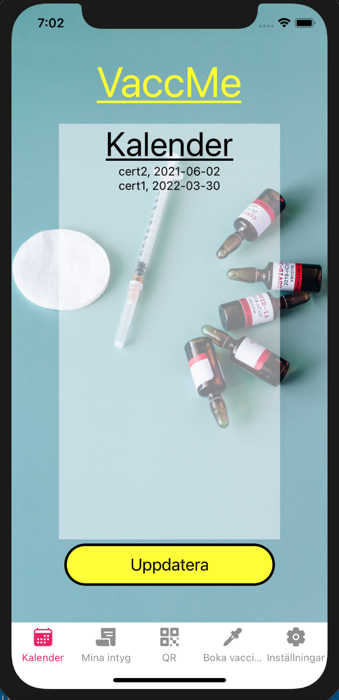
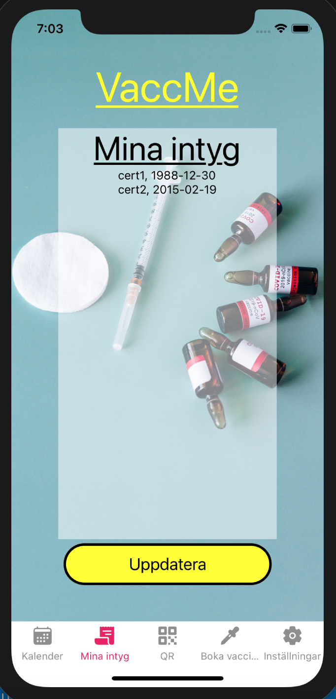

# vaccMe

An application for keeping track of vaccinations. Under development

# Trivia

The app is written in JavaScript using React Native.

# Views for development

## Splash


## WelcomeScreen


## PersonLoginScreen


## PersonScreen


Only exists as a navigator.

### PersonCalendarScreen



### PersonCertScreen



### PersonQrScreen


### PersonBookScreen


### PersonSettingsScreen


## BusinessLoginScreen


## BusinessScreen


Only exists as a navigator.

### BusinessHomeScreen


### BusinessQrScreen


# Dependancies

Using expo for deployment.

### QR-reader

-   Barcode scanner: `expo install expo-barcode-scanner`

```bash
expo install expo-barcode-scanner
```

### Navigation and tab bar

-   `npm install`
    -   @react-navigation/native
    -   @react-navigation/stack
    -   @react-navigation/bottom-tabs
    -   react-native-qrcode-svg (--legacy-peer-deps)
-   `expo install`
    -   react-native-reanimated
    -   react-native-gesture-handler
    -   react-native-screens
    -   react-native-safe-area-context
    -   @react-native-community/masked-view
    -   expo-secure-store

```bash
npm install @react-navigation/native @react-navigation/stack @react-navigation/bottom-tabs
```

```bash
expo install react-native-reanimated react-native-gesture-handler react-native-screens react-native-safe-area-context @react-native-community/masked-view expo-secure-store react-native-qrcode-svg
```

In some cases the react-native-qrcode-svg need the flag --legacy-peer-deps.
`TODO:` What cases?

### Google-api

-   `expo install expo-google-app-auth`

```bash
expo install expo-google-app-auth
```
